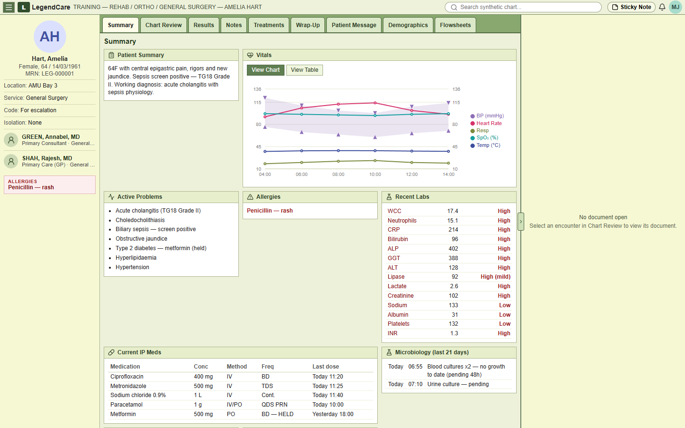
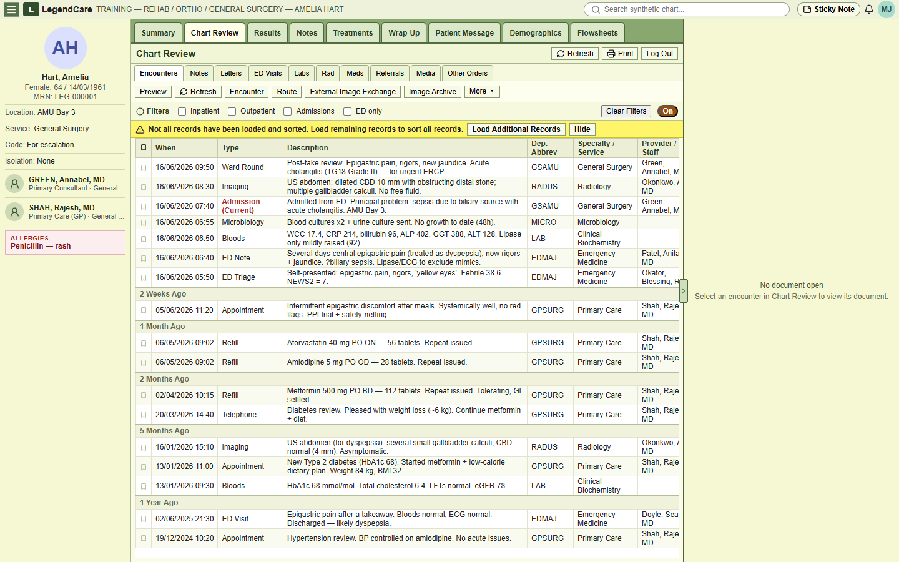
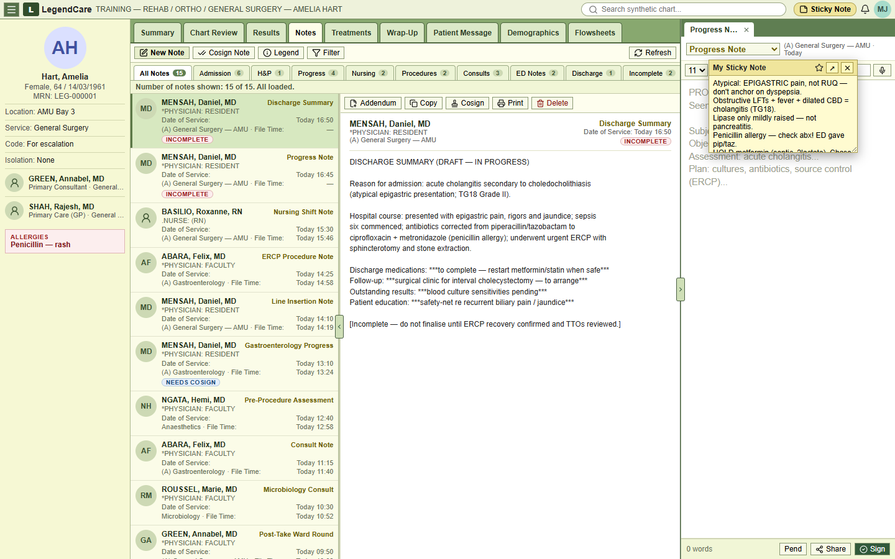

# Legend

Legend is a synthetic, Epic-style **EHR training simulator** that lets medical students practise chart review, clinical documentation, and safe decision-making on fictional patient cases, without touching any real patient data.

It recreates the parts of an electronic health record a student actually has to navigate (a summary view, a full encounter history with clickable lab and microbiology "receipts", and a clinical notes workspace) and wraps them around a deliberately *atypical* teaching case so the user has to reason rather than pattern-match.

> All patient data are synthetic and fabricated for teaching. Legend is for education and simulation only, **not** clinical decision-making.

> **Status: early work in progress.** One synthetic case is fully built out; the app is under active development and deliberately rough around the edges.

## Screenshots

**Summary view** — patient banner, vitals trend, active problems, labs, meds, microbiology:



**Chart Review** — Epic-style encounter timeline with recency buckets, filters, and clickable structured documents:



**Student working view** — mid-task: reviewing existing notes, drafting a new progress note in the editor (right), with the sticky-note reasoning scratchpad open:



## Features

- **Summary view** — patient banner, vitals chart and table, at-a-glance overview.
- **Chart Review** — an Epic-style encounters table with filters (inpatient / outpatient / ED / admissions); every row opens a viewable document, including structured **lab** and **microbiology** reports.
- **Notes** — a clinical notes browser and editor for practising documentation.
- **A worked teaching case** — an atypical cholangitis presentation (epigastric rather than RUQ pain, obstructive LFTs, a penicillin-allergy prescribing catch) designed to punish anchoring.
- **Synthetic-only by design** — simulation disclaimers are built into the report banners, not bolted on.

## Tech stack

React 19 + TypeScript, built with Vite. Charts via Recharts, icons via lucide-react, resizable panes via react-resizable-panels. No backend: all case data is typed and static, so there is nothing to provision and no data to leak.

## Quickstart

```bash
npm install
npm run dev      # start the dev server (Vite)
npm run build    # type-check and build for production
npm run lint     # eslint
```

Then open the local URL Vite prints (default http://localhost:5173).

## Status

Early prototype. One fully authored case (`cholangitis001`), single stylesheet, data stored as typed `.ts` documents (the renderers are data-driven, so a JSON/markdown case loader can be added later without touching them). Built solo with Claude Code.
